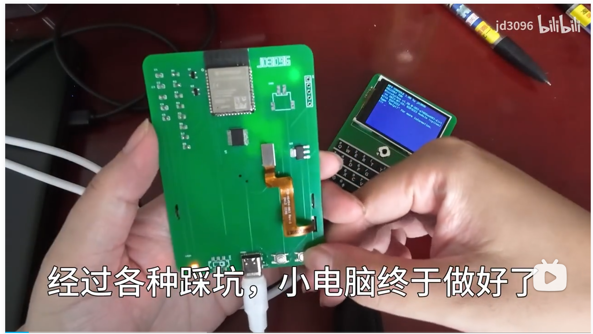

# MPY-CONSOLE

## 2023.8.7更新——已经实现了micropython的LVGL移植！双固件任选

求人不如求己，等这个靠那个，最后还是自己先造出来了，自学半年PCB，3d建模就硬搞，水平难免低，主打一个能用。

真的是micropython的独享，因为只有MPY有repl，现在轮到c羡慕mpy了。

每个项目的创意我都想很久，既要别人没做过的，还要尽可能有用有趣。

此项目将完全开源，因为真的没啥难度，试试能不能吸引人过来，自己一个人肝也没有乐趣。

**想来的V我：jd3096**

以下是一些扩展任务的想法：

###### 任务1：

做一个在线商店，可以下载其他人贡献的py程序，不要觉得难，我做过类似的有思路如下：

gitee建立一个库（方便国内下载），直接py文件丢上去即可，mpy段只需要requests库就可以拿下来，我之前的VFD-CLOCK已经实现了在线一键更新功能。

###### 任务2：

做一个串口调试app，类似电脑的串口助手，我特意预留了两个引脚，而且有键盘，既可以看输出，也可以输入简单调试，网上没有类似产品，力推，拜托界面弄好点。。。

###### 任务3：

肝一个UI库，有简单的对话框，输入框之类的，320*240的屏幕完全能用，不过不说了，我肝疼。。。谁肝硬谁来把！

###### 任务4：

做个时钟，最简单的了，撑门面的，有点创意最好。

###### 任务5：

做电脑副屏。。。比较烂大街的项目，总是有点用处的。。。

###### 任务X：

发挥你的想象，不要被我都想法束缚，任何好玩的或者有用的，都可以来试试，最好直接喷我做的系统垃圾，本人非专业计算机人士，难免造屎山，请向我示范如何优雅的构建系统。

## 引脚分布

|    功能    |     GPIO      |
| :--------: | :-----------: |
|    SCK     |      41       |
|    MOSI    |      38       |
|    MISO    |  37(可不用)   |
|     CS     |      39       |
|     DC     |      40       |
| BL（屏幕） |  36(不能用)   |
| BL（键盘） |      16       |
|  五向摇杆  | 4、5、6、7、8 |
|   KEY_TX   |      15       |
|  UART_TX   |       1       |
|  UART_RX   |       2       |

## 系统结构

### \app  PY运行目录   可从mpy repl直接运行的程序放这里

目前写好的demo app：

pics.py——仅仅显示一张图片

chat.py——巨简陋的espnow聊天室 ，只要有esp32靠近即可，无线且好用，理论上可以同时很多台互相聊天

wifi.py——设置系统wifi

### \utils  系统工具库目录  非系统开发者勿动

color.py——没错，本系统是支持主题配色变换的，无奈我没啥美术细菌，ui很丑

dos_font.py——扒出来的经典MS-DOS系统字体，等距复古

drivers.py——硬件驱动合集，屏幕、键盘等等

fbconsole.py——本项目的灵魂库，将mpy的repl输出到屏幕上，输入连接到键盘上

settings.py——设置相关，主要是读取写入配置的函数

ui.py——挑战纯手动撸UI，很肝很肝，肝帝可以挑战一下

setting.dat——json格式的设置存储文件

\ 根目录 最必要的文件

boot.py——启动项，可以通过按键改变启动内容等

run.py——运行外壳，能让repl环境正常运行py文件的包装壳，主要是确保屏幕、键盘不冲突、repl命令行不冲突不卡死等

start.py——正常进入repl模式的引导程序

## 固件说明

本项目秉承干净开源原则，除了为了提升显示效率使用ST7789的fastc 库，其他均为官方固件库，可放心食用。

[russhughes/st7789_mpy: Fast MicroPython driver for ST7789 display module written in C (github.com)](https://github.com/russhughes/st7789_mpy)

直接刷firmware下的固件即可。

## 硬件预览视频：

[自己做的micropython小电脑终于雏形机弄出来了_哔哩哔哩_bilibili](https://www.bilibili.com/video/BV1fj4119798/?spm_id_from=333.999.0.0&vd_source=16fd6d2ed1bceb65dca80ff0e6e9e8ec)
